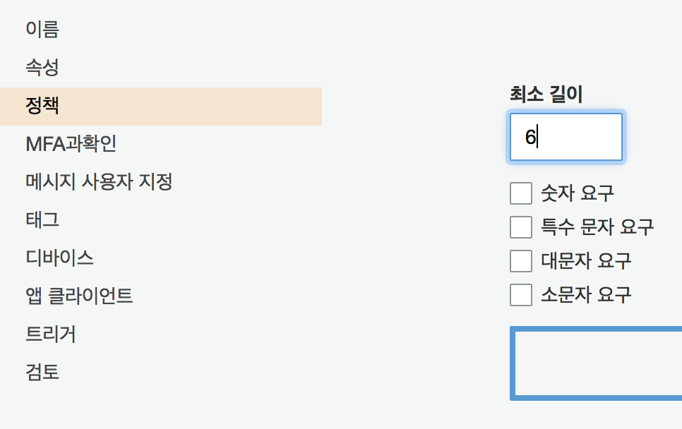
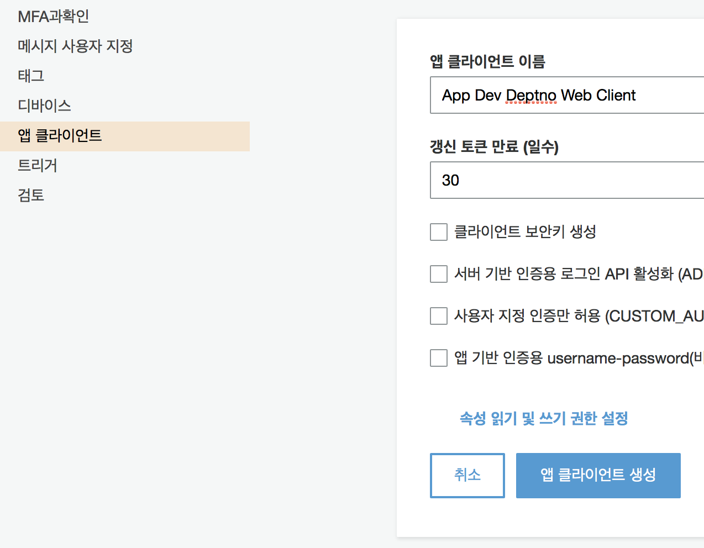
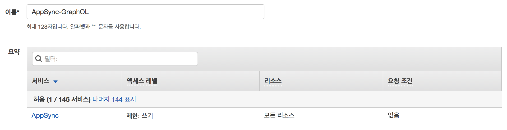
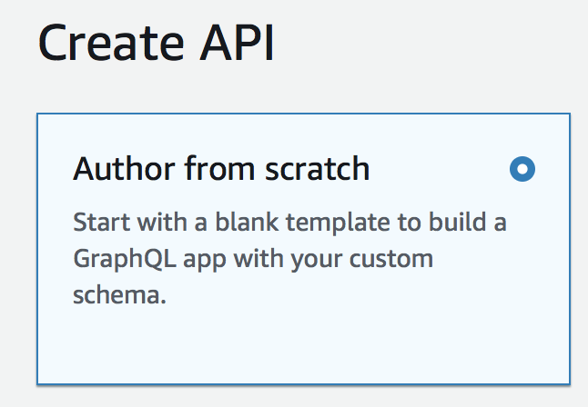
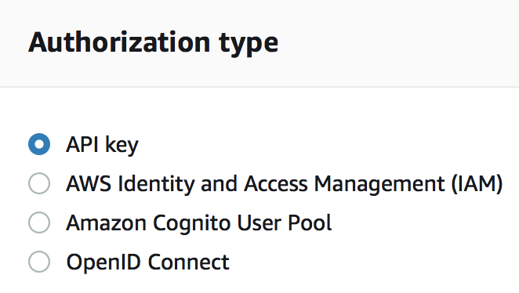
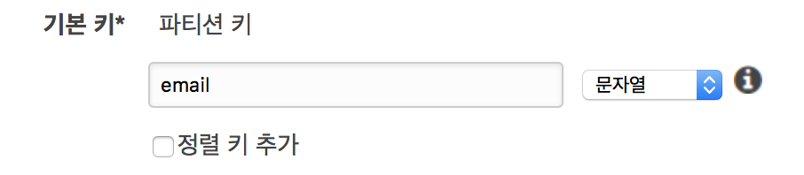
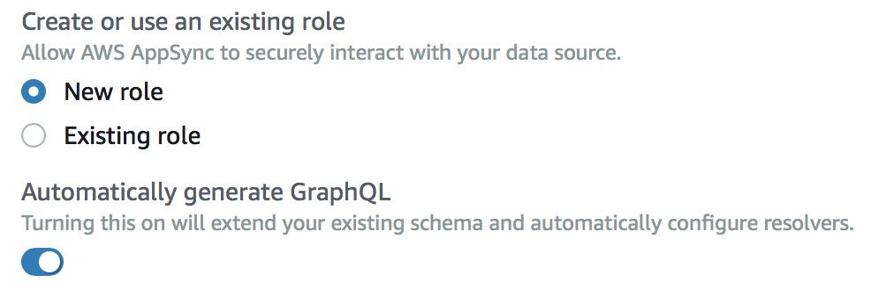

# AWS AppSync IAM exmaple

> :speaker: 진행 과정의 원할함을 위해 프로젝트 명은 `deptno` 로 가정한다.

> :speaker: IAM 을 통한 비인증 유저의 AppSync GraphQL 접근을 목표로 한다.

## 서론

> 😭 이 글은 눈물로 작성되었다. 눈물없이 가능하지 않았던 처절한 삽질을 말끔히 정리하고자 한다.

인증은 매우 복잡하면서도 중요한 파트로 여러가지 방식이 존재하고 일단 설정하면 바꾸기 어렵다. 때문에 시행착오를 통합 삽질을 하기에도 매우 두려운 부분이다. 그래서 명확히 이해 해야만 했고 거의 그럴뻔 했으나 만들어진 코드나 매우 소중이 다루자는 결론에 이르렀다?

**react-apollo** 와 같이 표준에 가까운 라이브러리 들이 있지만 여기선 `aws-amplify` 에서 제공하는 최소한만을 사용했다. AWS의 코드 샘플 자체가 **react-apollo** 기준이라 이 편이 더 도움이 될 거라 생각했다. 타 서비스도 GraphQL 를 사용해서 엔드포인트가 두개가 될 경우 골치아파지는데 그런 경우에 대응하기 위한 점도 고려됐다.

글은 프로젝트와 함께 진행된다. 이 프로젝트는 **AWS AppSync, Cognito, Amplify, DynamoDB** 를 통해 **비인증** 유저에게 **Graph QL** API 콜을 통한 데이터를 제공한다. 추가적으로 인증 유저에게 다른 권한을 부여하기 위함이다. 이 부분은 나중에 풀어보겠다. 아마도 이 길인 것 같아서 선택했다. :cherry_blossom:

프론트엔드 프로젝트와 함께 설정값을 넣으면서 그때 그때 필요한 AWS 리소스를 생성해가면서 진행하도록 한다. 때문에 진행은 프론트엔드와 AWS가 함께 진행된다. `configure.js` 파일을 채워나가면서 진행해보자.

동작에 대한 궁금증은 마지막 프론트엔드 프로젝트를 구현하면서 우리가 해왔던 것들이 어떤 영향을 갖는지 최대한 설명 해보겠다.

## AWS Amplify 설정

### 설치

프로젝트 디렉토리에 진입해서 `aws-amplify`패키지를 설치한다.

```
yarn add aws-amplify
```

프로젝트의 원활한 진행을 위해 내가 자주쓰는 **Next.jS** 를 기준으로 작성하겠다.

```bash
yarn add next
```

### 설정

```bash
touch configure.js
```

설정 파일을 만들고 다음과 같은 코드를 삽입한다.

```javascript
// configure.js
import Amplify from 'aws-amplify'

Amplify.configure({
    Auth: {
        identityPoolId: 'XX-XXXX-X:XXXXXXXX-XXXX-1234-abcd-1234567890ab', 
        region: 'XX-XXXX-X', 
        userPoolId: 'XX-XXXX-X_abcd1234',
        userPoolWebClientId: 'XX-XXXX-X_abcd1234', 
    }
})
```

설정에 입력된 바와 같이 4가지 필요하다.

- identityPoolId - **코그니토 연동 자격** 증명에 대한 풀 ID
- region - 서울이라면 **'ap-northeast-2'**
- userPoolId: - **코그니토 유저 풀** ID
- userPoolWebClientId - 코그니토 유저 풀 생성 후 **앱 클라이언트 설정** 에서 **시크릿 키 체크 해제** 후 생성된 ID

### Cognito 설정

먼저 유저풀을 생성한다.

#### 코그니토 유저 풀 생성(Optional)

https://ap-northeast-2.console.aws.amazon.com/cognito/users 에 접속 후 **사용자 풀 생성** 버튼을 클릭한다.

`Dev Deptno User Pool` 를 입력하고 기본값 검토를 누른다.

정책 > 암호 강도에서 체크박스를 모두 해제하고 자릿수를 6으로 설정한다.



앱 클라이언트 > 클라이언트를 추가하되 **클라이언트 보안키 생성** 을 해제한다. 이름은 `Dev Deptno Web Client` 로 했다.

다시 **검토** 로 이동해서 **풀 생성** 버튼을 누른다.

이전 **설정** 에서 만들었던 `configure.js` 에서 `userPoolId` 를 풀 생성 후 나오는 **풀 ID** 로 교체한다. **앱 클라이언트 설정** 으로 이동해서 클라이언트 ID 를 `userPoolWebClientId` 에 입력한다.

#### 코그니토 자격 증명 풀 생성(Required)

`Dev Deptno Identity Pool` 이름을 지정하고 **인증되지 않은 자격 증명에 대한 액세스 활성화** 를 **체크** 한다.

인증 공급자에서 `Cognito` 탭에 `configure` 에 입력한 `userPoolId` 와 `userPoolWebClientId` 를 순서대로 입력한다.

**풀 생성** 버튼을 눌러 풀을 생성한다. IAM 설정이 나오는데 **허용 **을 눌러서 인증, 비인증 유저에 대한 롤을 생성한다. 추가 후 나오는 자격 증명 풀 ID 를 `configure.js` 의 `identityPoolId` 에 넣는다.

##### IAM Role 설정

코그니토 자격 증명 풀을 생성할 때 인증되지 않은 자격 증명에 대한 액세스를 활성화 했다. 이때 미인증에 대한 `IAM ROLE` 도 함께 생성했는데 **Cognito Sync** 가 **AppSync** 로 대체되면서 정책 설정이 제대로 않아 `401` 에러가 발생한다.

이를 해결하기 위해 **IAM > 역할** 로 가면 역할을 이름을 변경하지 않고 그대로 갔다라면 `Cognito_DevDeptnoIdentityPoolUnauth_Role`  형식의 이름으로 역할이 존재한다. 이를 선택하고 **인라인 정책 > JSON** 을 선택하고 아래 데이터를 붙여넣는다.

```json
{
    "Version": "2012-10-17",
    "Statement": [
        {
            "Effect": "Allow",
            "Action": [
                "appsync:GraphQL"
            ],
            "Resource": "*"
        }
    ]
}
```

그리고 역할을 생성한다. 아래와 같은 형식으로 이름을 넣어주면 보기 편하겠다.



역할을 생성하고 정책이 연결됬으면 미인증 유저의 GraphQL 엔드포인트에 대한 접근이 허가된다.

---

## AppSync

**AppSync** 는 아직 서울 리전이 지원되지 않는다. 때문에 우린 도쿄로 간다.

> :cloud_with_lightning_and_rain: awsmobile cli 커맨드를 통해 생성하면 GraphQL 엔드포인트가 ap-northeast-2(서울) 로 설정파일이 생성되지만 서울 리전에는 아직 **AppSync** 가 존재 하지 않는다. 템플릿 예외 처리 오류로 보인다.

https://ap-northeast-1.console.aws.amazon.com/appsync/home?region=ap-northeast-1#/create AWS 콘솔에서 **AppSync** 를 선택하고 **Create API** 를 누른다. 템플릿이 몇개 주어지는데 **Author from scratch** 를 선택해서 깔끔하게 시작한다.



이름은 `Dev Deptno GraphQL` 정도면 멋진것 같다.

**Settings** 섹션으로 이동하면 인증 타입을 선택할 수 있다.

기본은 **API key** 다 헤더에 추가만 해주면 동작하므로 매우 간편한 방식이다. 우리는 **AWS Identity and Access Management** 를 선택한다.

이제 클라이언트에서 콜을 할때 가지고 있는 인증 권한에 따라 API 가 제한되게된다.

### DynamoDB 설정

> :speaker: **AppSync** 가 서울에서 지원이 안되다보니 서비스를 이동하다보면 리전이 꼬일 수 있다. 나머지 리소스는 서울임을 계속 확인하는 것이 좋다.

**AppSync** 가 데이터를 퍼다 나르기 위해서 데이터 소스를 연결해야하는데 이 프로젝트에서는 다이나모디비를 이용한다. AWS 콘솔에서 **DynamoDB** 를 선택한다.

**테이블** 섹션에서 **테이블 만들기** 를 누르고 이름이랑 키만 설정하면 바로 테이블이 생성된다.(어썸..👍)



파티션 키는 **email** 이라고 쓰고 대충 생성을 하자. 테이블 이름은 `Dev Deptno User` 로 한다.

> :thinking: 테이블 이름은 단수로 해야 GraphQL 스키마 자동생성을 할 때 깔끔하게 맞는 느낌이 있다..

### Data Source 추가

다시 AWS 콘솔에서 **AppSync** 로 돌아온 뒤 **Data Source** 섹션을 선택하고 새로운 소스를 추가하기 위해 **New** 를 누른다.

**Data source name** 을 설정하는데 여기선 공백이 먹지 않으므로 다이나모디비 프리픽스를 붙이고 파스칼 케이스로 이름을 정했다.

`DDB_DevDeptnoUser` 

**Data source type** 에서는 `Amazon DynamoDB Table` 을 선택한다.

**Region** 은 서울이므로 `AP-NORTHEAST-2` 를 선택한다.

**Table name** 은 아까 생성한 `Dev Deptno User` 를 선택하거나 입력한다.

> :thinking: 가끔 테이블을 제대로 불러오지 못하니 그럴경우 그냥 입력한다.

**Create or use an existing role** 에서는 `New role` 을 선택한다.

**Automatically generate GraphQL** 를 활성화하면 친절하게도 스키마를 바로 뽑아준다. 활성화 하자.



**Create** 를 눌러 데이터 소스를 생성하자. 생성이 완료되면 **Schema** 섹션으로 이동해서 스키마가 잘 생성됐는지 확인한다. 생성된 스키마에 대한 테스트는 바로 아래 섹션인 **Queries** 에 **Graphiql** 느낌의 클라이언트가 들어가있어 바로 확인이 가능하다.

이제 생성된 **AppSync API** 정보를 바탕으로 `configure.js` 파일을 업데이트 하자.

```javascript
//configure.js
import {AUTH_TYPE} from 'aws-appsync/lib'
const configuration = {
  Auth: {
    //...
  },
  aws_appsync_graphqlEndpoint: 'https://xxx.appsync-api.xx-xxxxx.amazonaws.com/graphql',
  aws_appsync_region: 'xx-xxxx-x',
  aws_appsync_authenticationType: AUTH_TYPE.AWS_IAM,
  graphql_endpoint_iam_region: 'xx-xxxx-x'
}
```

**API Details** 에 있는 **API URL** 이 `aws_appsync_graphqlEndpoint` 다. `aws_appsync_region`, `graphql_endpoint_iam_region` 은 모두 도쿄에서 생성했으므로  `ap-northeast-1` 을 넣어주면 된다. `aws_appsync_authenticationType` 은 `"AWS_IAM"` 인데 상수가 정의되어 있으므로 그를 이용한다.

> :information_desk_person: AUTH_TYPE

`AUTH_TYPE` 에 따른 추가적인 데이터가 반드시 필요하다.

- AWS_IAM - `graphql_endpoint_iam_region`
- AWS_API - `  aws_appsync_apiKey`
- AMAZON_COGNITO_USER_POOLS - 

## Front-end

드디어 프론트엔드다. 그럼 이제 설정만 있는 프론트엔드 프로젝트를 고도화해보자.

### Next.js

**Next.js** 기반이므로 그에 대한 구조를 갖춰주자. **Next.js** 는 `pages` 디렉토리 밑을 통해 라우팅이 된다는 점이 특징이니 따로 라우터 설정은 하지 않아도 된다. CRA(`create-react-app`) 의 컨벤션 룰이 내겐 너무 갑갑해서 사용하는 것일 뿐 어려운 점은 없다. 그냥 파일 두개를 만들면 된다.

```bash
mkdir pages
touch pages/index.jsx
touch graphql.js
```

```jsx
//pages/index.js
import * as React from 'react'
import '../configure'
import {createUser, getUsers} from '../graphql'

export default class extends React.Component {
  readonly state = {
    users: null,
    email: ''
  }

  render() {
    return (
      <div>
        Hello world!<br/>
        {this.state.users && <pre>{JSON.stringify(this.state.users, null, 2)}</pre>}
        <form onSubmit={this.handleOnSubmit}>
          <input
						type="text"
						value={this.state.email}
						onChange={this.handleOnChangeEmail}
					/>
          <button>추가</button>
        </form>
      </div>
    )
  }

  async componentDidMount() {
    this.users()
  }

  async users() {
    this.setState({users: await getUsers()})
  }

  handleOnChangeEmail = (e) => {
    this.setState({email: e.target.value})
  }

  handleOnSubmit = async (e) => {
    e.preventDefault()
    await createUser(this.state.email)
    this.users()
  }
}
```

```javascript
//graphql.js
import {API, graphqlOperation} from 'aws-amplify'

export const getUsers = () => API
  .graphql(graphqlOperation(queryUsers))
  .catch(_ => [])

export const createUser = (email: string) => API
  .graphql(graphqlOperation(mutationCreateUser, {email}))
  .catch(_ => null)

const queryUsers = `query DeptnoUsers {
  listDeptnoUsers {
    items {
      email
    }
    nextToken
  }
}`

const mutationCreateUser = `mutation CreateDeptnoUser($email: String!) {
  createDeptnoUser(input: {email: $email}) {
    email
  }
}`
```

코드에 대한 설명은 따로 필요 없을 것 같다. **React** 와 **GraphQL** 에 대한 지식이 조금 있으면 된다. **query** 는 AWS 콘솔에서 **AppSync**, 생성한 API를 선택한후 **Schema** 누르면 참조할 수 있다.

### 실행

이제 코드를 만들었으니 실행을 하면 된다.

```bash
npx next
```

---

## 연관 링크

깃허브에 코드가 공개되어 있으며 코드는 타입스크립트를 기준으로 짜여졌으나 이해하기에 다르지 않다.

<https://github.com/deptno/aws-appsync-iam-example> 예제 코드 깃허브 저장소.

<https://blog.bglee.me/posts/2018/aws-appsync-iam> 본 글의 블로그 포스트. - 후속 업데이트가 있다면 블로그에서 진행된다.

---

## 부록

> :information_desk_person: `aws-amplify-react` 를 사용하면 인증에 대한 처리 분기를 리액트에서 보다 쉽게 할 수 있다. [공식 문서](https://aws-amplify.github.io/amplify-js/media/quick_start#add-user-authentication-to-your-app)

> :information_desk_person: `aws-appsync-react` 패키지는 `apollo-react` 를 사용할때 오프라인 제어 및 로컬 캐싱을 위한 지원이 있는 것으로 보인다. `apollo-react` 의 사용 유저라면 반드시 문서를 참조해보도록 한다. [깃허브](https://github.com/awslabs/aws-mobile-appsync-sdk-js#readme)